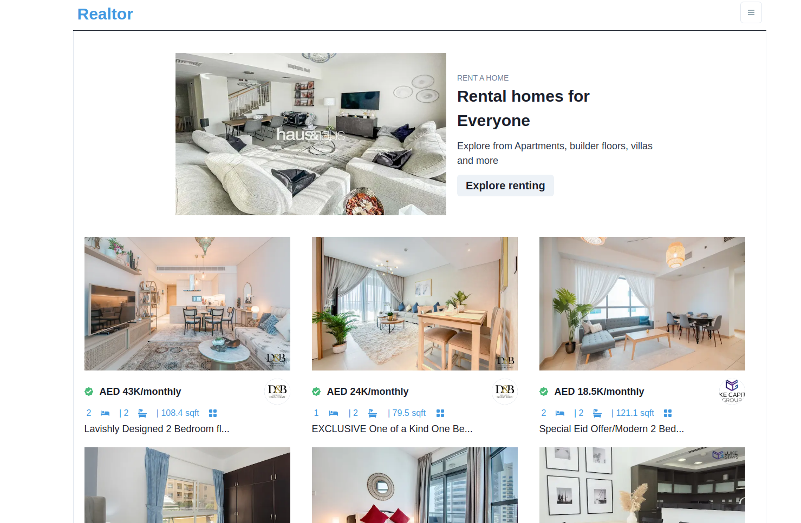
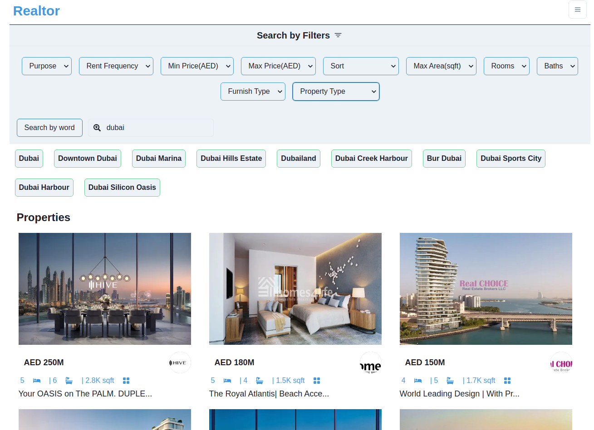
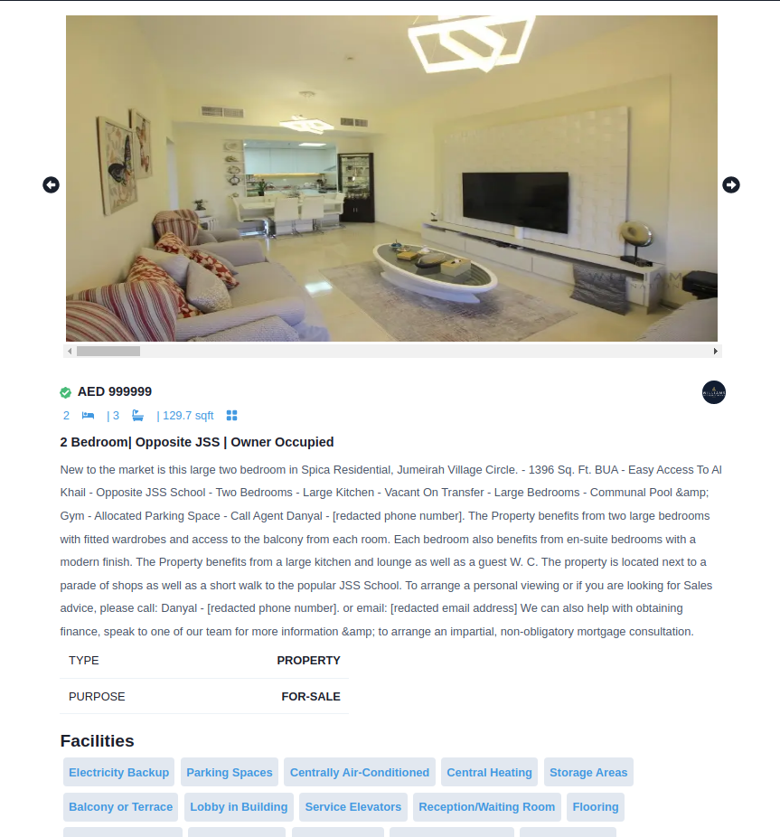

## Intro
A real estate website built with: 
- React 
- NextJs
- ChakraUI

Nextjs functions `getStaticProps()` and `getServerSideProps()` used 
To fetch data from RapidApi for server side rendering

## Live site
The live site can be found at  https://nextjs-real-estate-eight.vercel.app/

## Screenshots



## Getting Started

First, run the development server:

```bash
npm run dev
# or
yarn dev
```

Open [http://localhost:3000](http://localhost:3000) with your browser to see the result.
